# 💼 智能简历平台（SmartCV）

> 一个基于 Streamlit 与大模型能力开发的智能简历分析系统，支持上传简历、职位匹配、评分打分、优化建议、大模型解析与结构化存储等功能。  

---

## 🌟 项目亮点

- 🧠 **大模型赋能**：调用大语言模型（如智谱/ChatGPT）自动分析简历内容
- 📄 **简历结构化管理**：支持上传简历、提取字段、持久化存储
- 📊 **岗位匹配评分**：简历与岗位的适配度评分与图表展示
- 👨‍💻 **个人主页展示**：个人信息、头像、分析记录等
- 📂 **职位管理功能**：支持HR/用户自定义职位信息并调用分析

---

## 🖼️ 项目界面预览

> 👉 以下为系统界面展示：

### 🎬 欢迎页面


### 🔐 登录注册页

#### 登录

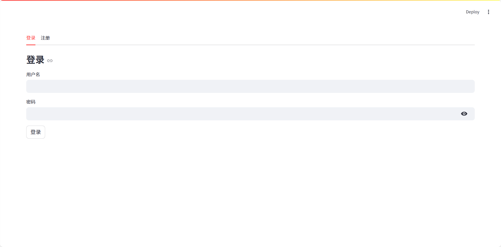

#### 注册

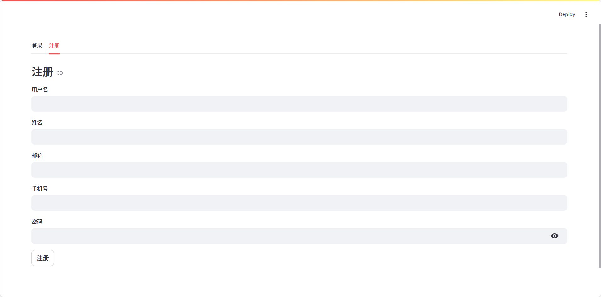

### 🏠 主界面导航栏

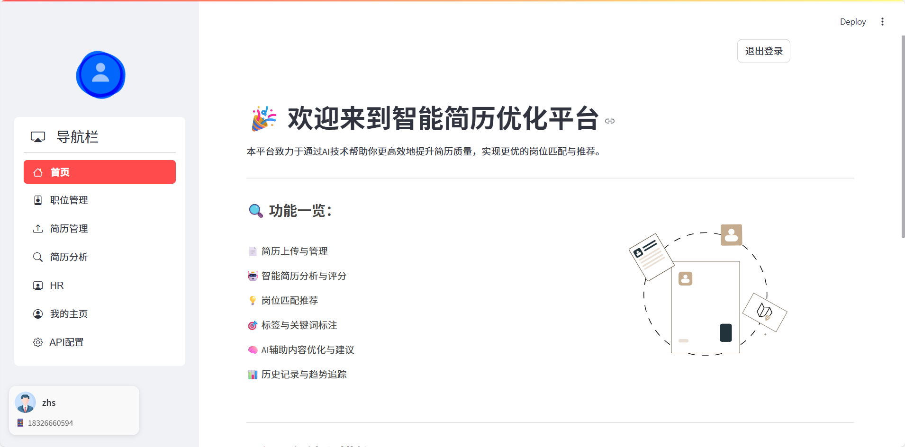

### 📄 简历管理

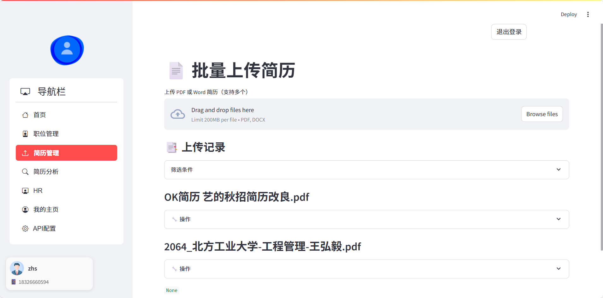
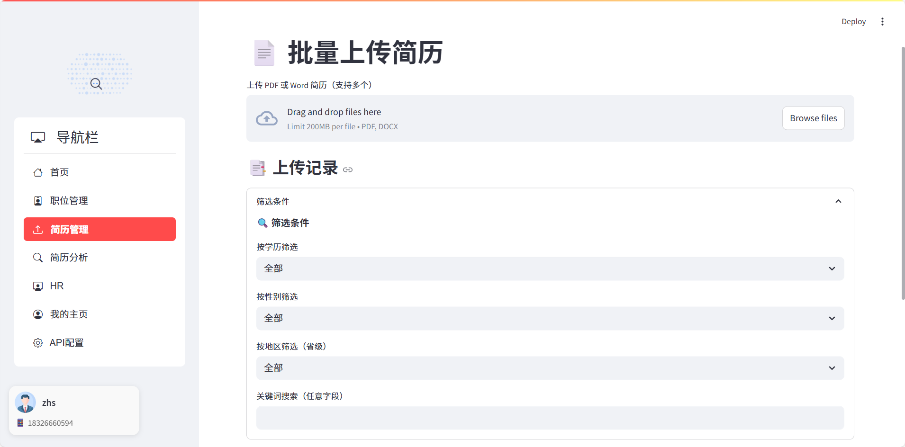
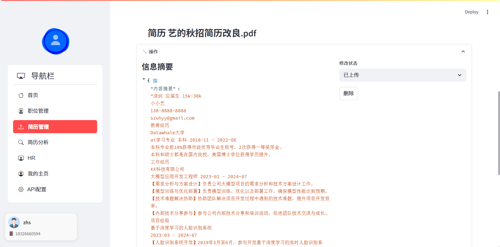

### 📤 简历分析

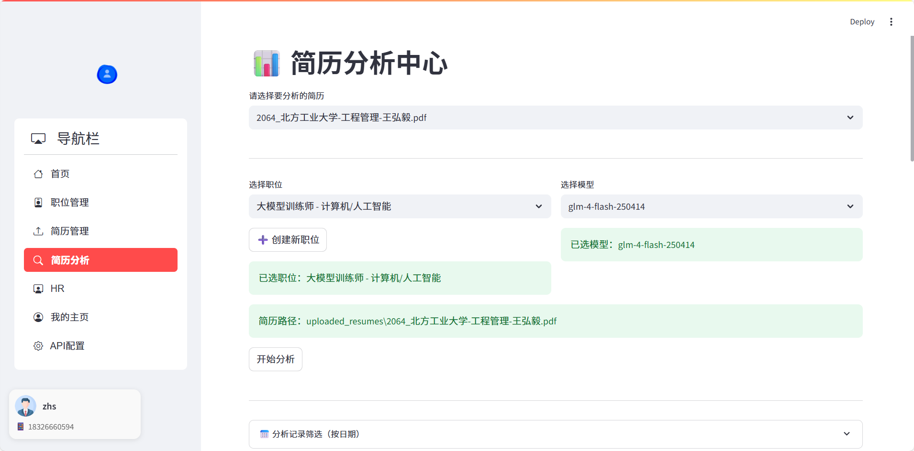
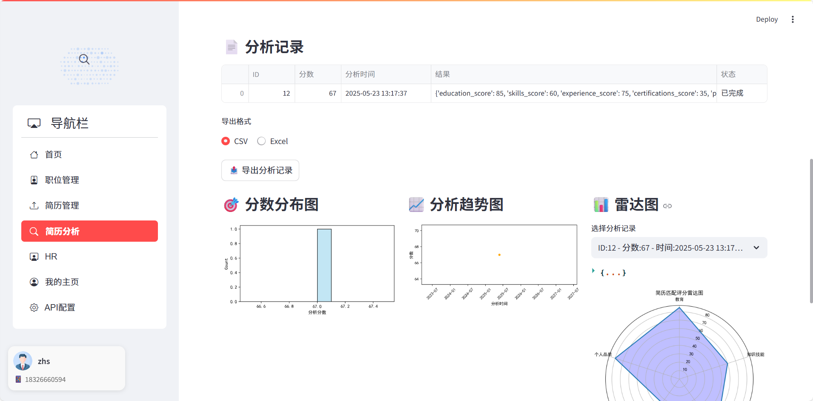
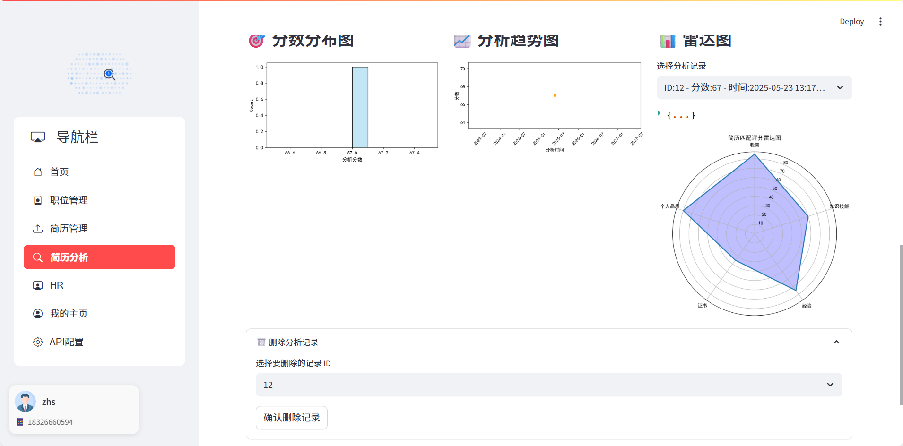

### 💼 职位管理

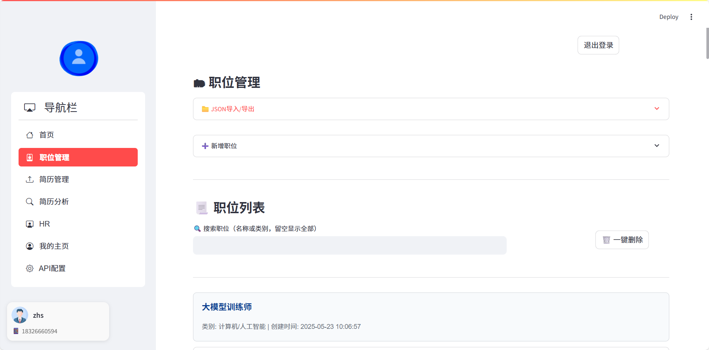
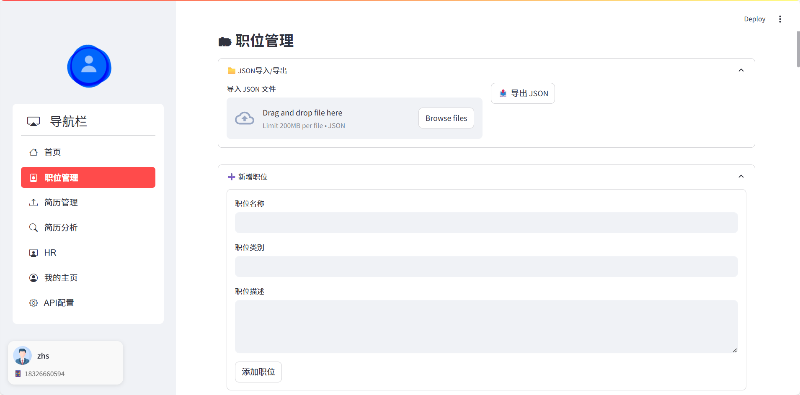

### 🧠 HR智能洞察

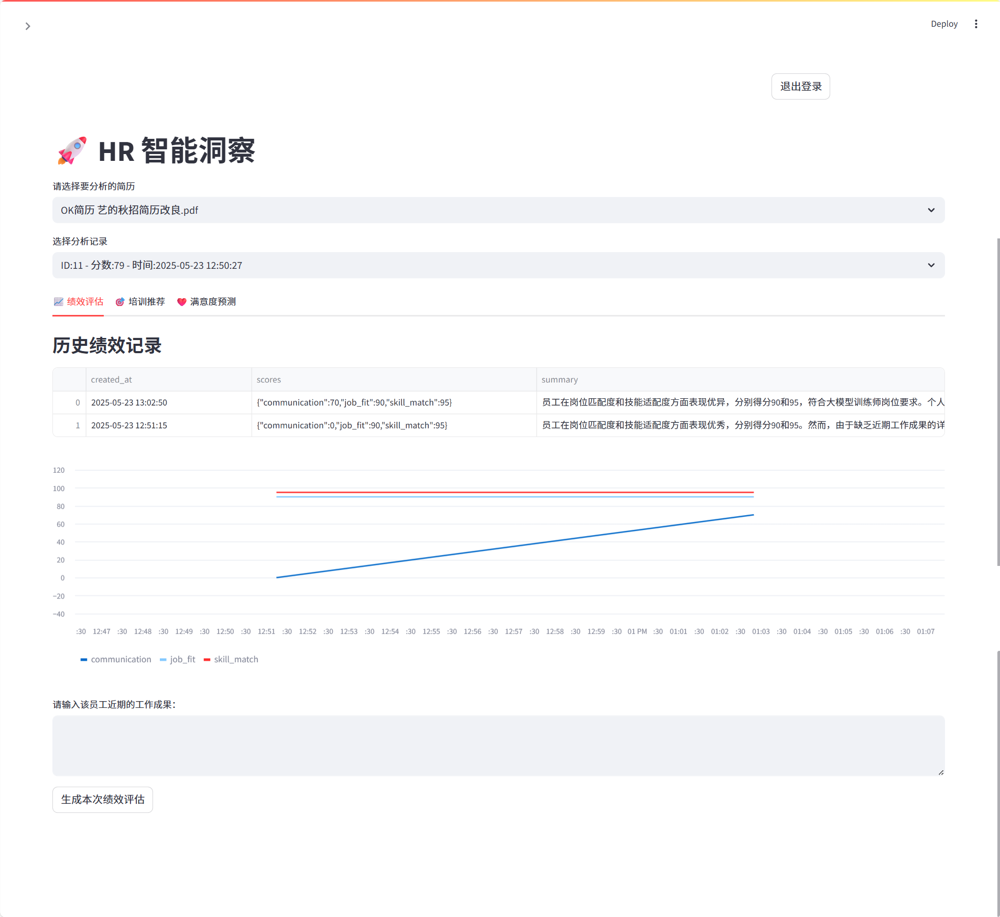
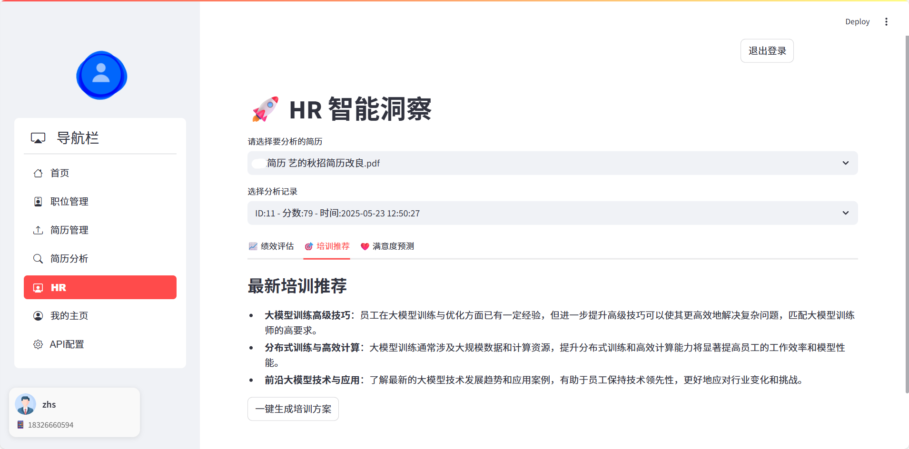
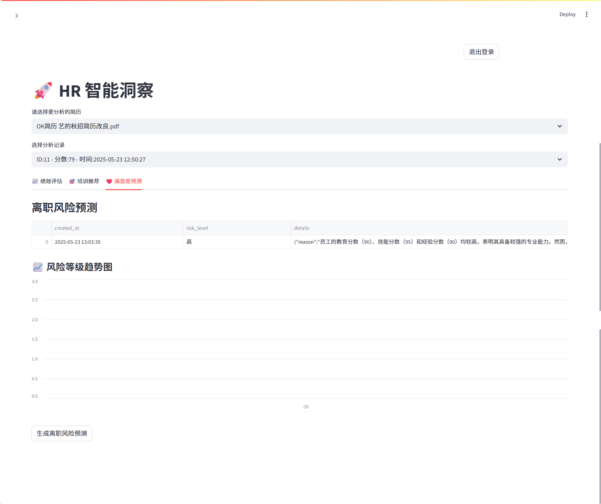

### 🎨 UI样式与加载动画

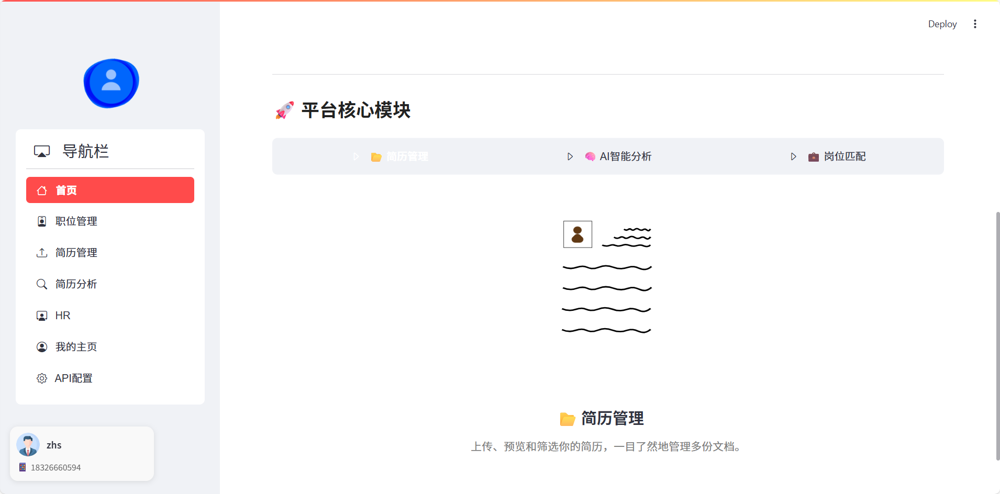

### 🤖 智谱 API 接入示例

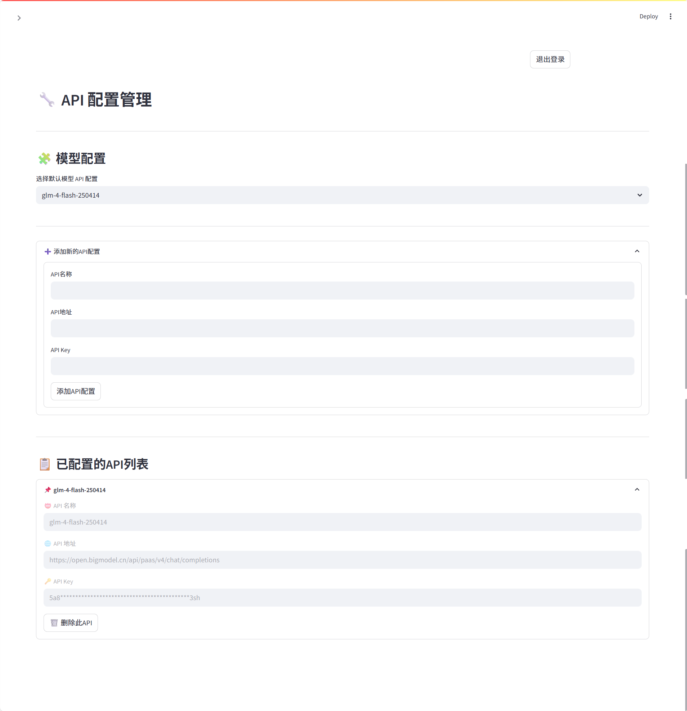

## 📁 项目结构说明

### 根目录文件

| 文件名                                  | 说明                                      |
| ------------------------------------ | --------------------------------------- |
| `main.py`                            | 主程序入口 |
| `jobs.db`                            | 本地 SQLite 数据库文件（用于早期测试）                 |
| `init_mysql.py`                      | 初始化 MySQL 数据库的脚本                        |
| `zhipuapi.py`                        | 调用智谱大模型 API 的模块                         |
| `config.yaml` / `config/config.json` | 配置文件（建议统一为一种格式）                         |
| `README.md`                          | 项目说明文档                                  |
| `requirements.txt`                   | Python 依赖列表                             |
| `start.sh` / `start_streamlit.sh`    | Linux 启动脚本                              |

---

### 📁 文件夹说明

#### `assets/`

存放动画、图片、JSON 模板等资源文件，用于 UI 展示和加载提示。

---

#### `Component/`

核心功能模块，所有子模块均有对应 `ops` 文件进行逻辑封装。

* `Analysis_record/`：简历分析记录操作逻辑
* `APIop/`：智谱 API 调用及数据库接口封装
* `Display/`：UI 样式配置与加载动画设置
* `HR_ops/`：人力资源洞察分析模块
* `JOB_manage/`：职位管理与 JSON 模板导入
* `Login/`：用户认证、登录注册逻辑（支持 MySQL）
* `Myinfo/`：个人信息展示与修改功能
* `ResumeAnalysis/`：简历结构化、匹配分析及大模型调用
* `ResumeManeger/`：简历上传、解析与存储管理模块

---

#### `DB/`

数据库操作封装层：

* `database.py`：SQLite 支持模块
* `mysql_db.py`：MySQL 支持模块（推荐用于生产环境）

---

#### `oputils/`

工具类集合：

* `config_utils.py`：配置文件加载工具
* `haxi.py`：密码哈希工具
* `secret.py` / `.key`：用户加密密钥与加解密逻辑
* `db_config.py`：数据库连接配置文件

---

#### `Reference/`

简历与职位示例集合：

* `jobs.json`：职位参考模板
* `resumes/`：用于测试或演示的简历文件（支持 PDF、DOCX 等格式）

---

### 🔧 安装与运行

```bash
# 1. 创建虚拟环境（可选）
python -m venv venv
source venv/bin/activate  # or venv\Scripts\activate

# 2. 安装依赖
pip install -r requirements.txt

# 3. 运行项目
streamlit run main.py
```

---

### ✅ 模块说明  

| 模块名称        |功能说明|
| ------------------------------------ | --------------------------------------- |
|main.py        |项目入口及页面控制逻辑|
|SPAGES/        |包含所有页面模块函数（主页、分析页、职位页）|
|DB/        |数据库初始化及查询模块|
|Component/        |用户登录注册、样式加载、权限验证等组件|
|assets/        |动画资源如 lottie json|
|styles/        |自定义 CSS 样式文件|
|screenshots/        |项目截图预览用目录|

## 🤝 联系作者  

> 如需合作或交流，请通过以下方式联系：

💬 微信/QQ：2041179302

📧 邮箱：[点我](rusuanjun_2022@qq.com)
